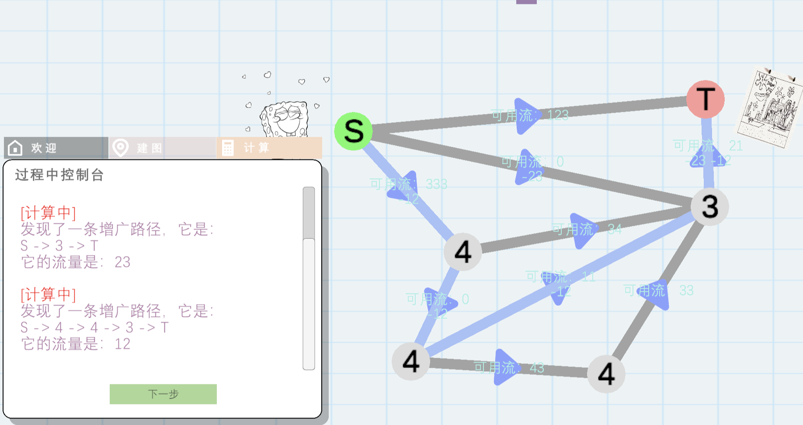

# 运筹学模型-最大流可视化 WEB App

一个由Unity引擎制作的Web版本的应用程序。可以在软件中建造图的模型，然后进行一些计算操作，并且得到一些结果。

算法是增广路径DFS，寻找剩余的流量，直到没有可用的剩余流量为止。本软件可视化了了这个操作。

# Usage
- 用服务器模式托管index.html文件，本项目和Unity传统WebGL项目一样，使用Mono WebAssembly技术实现。请参考官网教程。

# Reference

按照开源协议，请完整附带这些信息。
- live2dcubim SDK
- Unity（优乐帝）和及其商标由（美）Unity公司所有

本项目是 琦毓 同学大创项目《运筹学模型计算及应用研究》课题研究的一个部分。此部分（本Unity程序）由 PowerBear（千里） 同学编写。

引用请附带这些信息。

开源许可：MIT。（请见本项目的License）